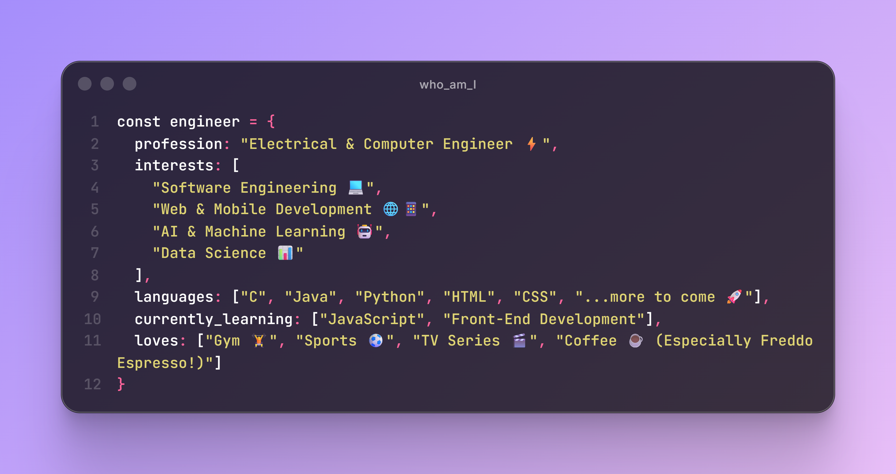

<h1 align="center">Hey there 👋</h1>

  

---

I'm an **AI Engineer** at **CloudFin**, building **intelligent document processing** pipelines that turn messy Greek administrative, legal, and insurance documents into clean, structured data.  
My day-to-day moves between **prompt engineering**, **LLM benchmarking & deployment on Vertex AI**, and **backend development**.

🎓 ECE graduate, Technical University of Crete (thesis: coronary artery segmentation with deep learning)  
☕ Powered by Freddo Espresso.  
⚡ Driven by curiosity.

---

### 🚀 Currently Exploring
- 🤖 AI agents & tool-using LLMs (Google ADK, Gemini)
- 📄 Document AI: OCR post-processing, extraction & classification
- ⚙️ Backend systems: FastAPI, workflow orchestration, database design
---

### 🛠️ Tech I Work With
`Python` · `FastAPI` · `Google Cloud / Vertex AI` · `Gemini` · `PostgreSQL` · `SQL Server` · `Azure` · `Camunda`
